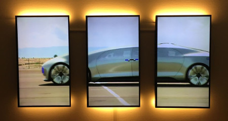

# Video Wall Video/Image player

This package allows you to play back videos and images on
multiple screens. Build a giant video wall with ease.

## Configuration

Similar to other packages you can configure a playlist
consisting of images and videos. It's recommended to use the
*Asset Browser* for easy selection of assets.

In the *Layout Configuration* section you can set how many
screens your video wall setup consists of. You can also tell
the system if all monitors are rotated (clockwise). A setup
with 3x1 screens rotated 90 degree might look like this:

Finally you must assign devices to each grid location. Click
on *Add Device*, then select the grid position (x=1, y=1 is
in the top left corner) and select the device that should
display this location.

If you have multiple video walls that should display the
same content, you can also assign multiple devices to the
same grid position.

## Standalone usage

Have a look at the included [STANDALONE.md](STANDALONE.md)
file to read more about how you can use this package outside
of info-beamer hosted.
